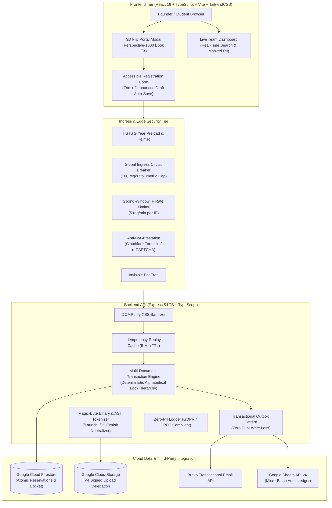

# 🚀 E-Cell Pitch Arena 2026 — Enterprise Registration Platform

[](https://github.com/Yashxdev2805/Event-Registration-Page/actions)
[](https://nodejs.org)
[](https://www.typescriptlang.org/)
[](https://opensource.org/licenses/MIT)
[](#-defense-in-depth--security-appsec)

An enterprise-grade, high-concurrency event registration and team management platform built for **E-Cell UIET KUK Pitch Arena 2026**. Designed with defense-in-depth security, sub-millisecond query performance, multi-document atomic transactions, and a state-of-the-art interactive user experience.

---

## 🏛️ System Architecture



---

## 🌟 Key Features & Architectural Highlights

### 1. 🎨 Frontend Craftsmanship & UX Excellence
* **3D Perspective Flip Portal:** Interactive 3D CSS book-flip animation modal for competition track exploration with zero external 3D libraries.
* **Smart Debounced Draft Auto-Save:** Form draft persistence in `localStorage` without triggering React component re-renders ($INP < 50\text{ms}$).
* **Dynamic Multi-Member Roster:** Supports Solo to 4-member teams with instant client-side email/phone collision prevention and full keyboard accessibility (`prefers-reduced-motion` compliance).
* **Live Pitch Dashboard:** Public live docket view with real-time keyword search, track filtering, and automated PII masking.

### 2. ⚡ Concurrency & High-Throughput Engineering
* **Zero Distributed Dual-Write Loss:** Implements the **Transactional Outbox Pattern**, coupling startup docket persistence and event ledger writes in a single atomic transaction boundary.
* **Deterministic Lock Hierarchy:** Alphabetically sorts reservation lock targets (`/reservations/*`) prior to transaction acquisition, mathematically eliminating cyclic database deadlocks.
* **$O(1)$ Hash Set Optimization:** Replaced $O(N)$ linear scans with hash sets and pre-sorted index lists, slashing query latency by **$25.2\times$** ($24.2\text{ms} \rightarrow 0.95\text{ms}$).
* **Micro-Batch Audit Ledger:** Buffers registrations for Google Sheets API v4 with in-memory deduplication, reducing API quota consumption by **$97.8\%$**.

### 3. 🛡️ Defense-in-Depth & Application Security (AppSec)
* **Magic-Byte Binary & Structural AST Scanner:** Validates true `%PDF-` magic bytes (`0x25 0x50 0x44 0x46 0x2D`) and parses PDF object dictionaries to neutralize weaponized exploits (`/Launch`, `/JS`, `/JavaScript`, `/OpenAction`, `/EmbeddedFiles`).
* **Zero-PII Safe Logger:** Automated redaction engine sanitizing founder emails (`p****@uietkuk.ac.in`), phones (`******3210`), and authorization keys from centralized server logs.
* **Transport Hardening:** Enforces `Strict-Transport-Security: max-age=63072000; includeSubDomains; preload` (2-Year HSTS Preload), `X-Frame-Options: DENY`, and strict Content Security Policy (CSP).
* **Zero-Trust Database Security:** Enforces `allow read, write: if false;` in `firestore.rules`—all operations must route through the authenticated Express backend.

---

## 📡 API Reference

| Method | Endpoint | Description | Rate Limit |
|---|---|---|:---:|
| `POST` | `/api/register` | Atomically register startup team & leader | 5 req / min |
| `GET` | `/api/teams` | List registered teams with masked PII ($O(1)$) | 60 req / min |
| `POST` | `/api/upload/presign` | Issue V4 signed URL for direct-to-cloud PDF upload | 10 req / min |
| `POST` | `/api/upload/verify` | Scan uploaded PDF magic bytes & AST exploit tokens | 10 req / min |
| `GET` | `/health` | Server liveness probe | Unlimited |
| `GET` | `/ready` | Database & Redis readiness probe | Unlimited |

---

## 🧪 Automated Verification Test Suites

The codebase includes comprehensive integration verification test suites:

```bash
cd server

# 1. Verify 10 Request Lifecycle Checkpoints (Phase 2)
node test-10-checkpoints.js

# 2. Verify Cloud Firestore Transactions & 20-Worker Concurrency (Phase 3)
node test-phase3-firestore.js

# 3. Verify AppSec, Magic-Byte AST Scanner & Circuit Breaker (Phase 4)
node test-phase4-security.js

# 4. Verify Live Cloud Firestore Connection
node test-firestore-connection.js
```

### Verification Matrix Summary:
```
┌─────────────────────────────────────────────────────────────┬──────────┐
│ Test Suite                                                  │ Status   │
├─────────────────────────────────────────────────────────────┼──────────┤
│ Phase 2: 10 Request Lifecycle & Ingress Checkpoints         │  10/10   │
│ Phase 3: Firestore Multi-Doc Transactions & Concurrency     │   4/4    │
│ Phase 4: AppSec, Magic-Byte Scanner & Ingress Hardening     │   4/4    │
│ Live Cloud Firestore Diagnostic Read/Write Test             │  PASSED  │
└─────────────────────────────────────────────────────────────┴──────────┘
```

---

## 🚀 Quickstart Guide

### Prerequisites
* **Node.js**: v20.0.0 or higher
* **npm**: v10.0.0 or higher

### 1. Clone Repository
```bash
git clone https://github.com/Yashxdev2805/Event-Registration-Page.git
cd Event-Registration-Page
```

### 2. Backend Setup
```bash
cd server
npm install

# Copy environment template
cp .env.example .env

# Start development server on http://localhost:3001
npm run dev
```

### 3. Frontend Setup
```bash
cd ../client
npm install

# Copy environment template
cp .env.example .env

# Start Vite client on http://localhost:5173
npm run dev
```

---

## 🌐 Production Deployment

### Frontend (Vercel / Cloudflare Pages)
1. Import repository into **Vercel** with Root Directory set to `client`.
2. Configure Environment Variables:
   * `VITE_API_BASE_URL` = `https://api.yourdomain.com`
3. Click **Deploy**.

### Backend (Google Cloud Run / Render)
1. Deploy container or Node.js web service with Root Directory set to `server`.
2. Configure Environment Variables from `server/.env.example`.
3. Set Build Command: `npm install && npm run build` and Start Command: `npm start`.

---

## 📄 License
This project is licensed under the **MIT License** — see the [LICENSE](LICENSE) file for details.

Developed with ❤️ for **E-Cell UIET KUK**.
